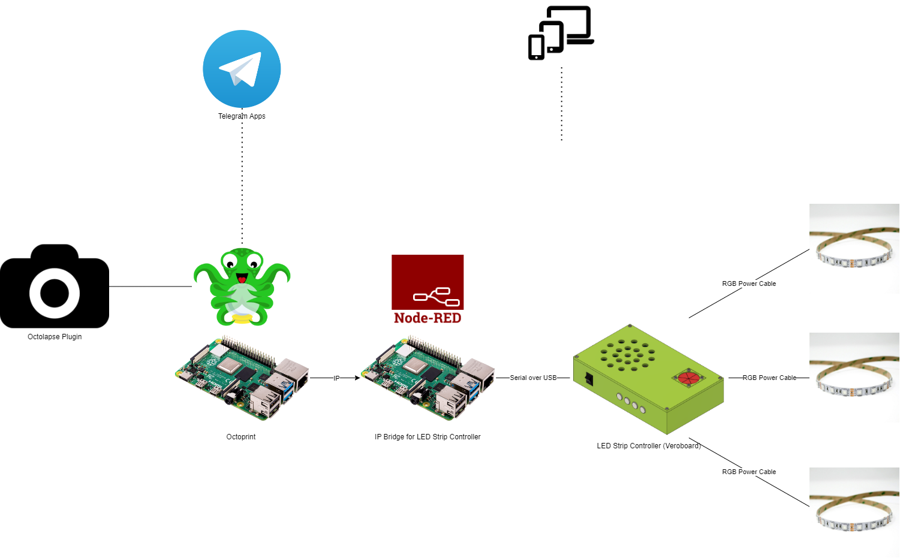

# Octoprint LED Strip Controller Integration Script
<!-- markdown-link-check-disable -->
[](https://www.gnu.org/licenses/gpl-3.0) [](https://github.com/ScottGibb/LED-Strip-Controller-Octoprint/actions/workflows/Mega%20Linter.yaml)
<!-- markdown-link-check-enable -->


## Summary

This repository contains the scripts necessary for the integration of the LED Strip Controller project into Octoprint. The architecture of the system is such that a Python Script is used to control the LEDs assigned to the 3D printer shelf over an IP socket. This Python script can be called directly
from the Telegram Plugin linked below, however, the Octolapse plugin does not interact with python scripts. Therefore basic bash scripts are used to call the python script and the bash script is called by Octolapse.

## System Architecture

The architecture of the system as of the 28/08/2023 is shown below:



## Repository Structure

The structure of the repository is outlined below:

```bash
    ├── .github
    │   └── workflows
    │       └── Static Analysis.
    ├── docs
    │   └── 
    ├── scripts
    │   ├── TurnOffLights.sh
    │   ├── TurnOnLights.sh
    │   └── README.md
    ├── src
    │   ├── __init__.py
    │   ├── main.py
    │   └── Communications # TODO: Move to seperate Sub Module
    │       ├── __init__.py
    │       └── CommsProtocol.py
    |       └── Types.py
    ├── .gitignore
    ├── .pylintrc
    ├── LICENSE
    |── markdownlint.json
    ├── README.md
    └── .yamllint.yaml
```

At the moment the project requires the communications python code which is copied directly from the software repository, this should be replaced with a submodule in the future. Which uses Google Brotobuff for multiple language support.

## Octoprint Links

- [Octoprint](https://octoprint.org/)
- [Telegram Plugin](https://plugins.octoprint.org/plugins/telegram/)
- [Octolapse Plugin](https://plugins.octoprint.org/plugins/octolapse/)

## LED Strip Controller Repository Links

The rest of the LED Strip Controller project can be found at the following links:

- [Manifest](https://github.com/ScottGibb/LED-Strip-Controller-Manifest) This repository contains the manifest file for the LED Strip Controller project. Which allows the cloning of all the repositories in one go.
- [Hardware](https://github.com/ScottGibb/LED-Strip-Controller-Hardware) This repository contains the hardware design files for the LED Strip Controller project.
- [Firmware](https://github.com/ScottGibb/LED-Strip-Controller-Firmware) This repository contains the firmware for the LED Strip Controller project.
- [Software](https://github.com/ScottGibb/LED-Strip-Controller-Software) This repository contains the software for the LED Strip Controller project.
